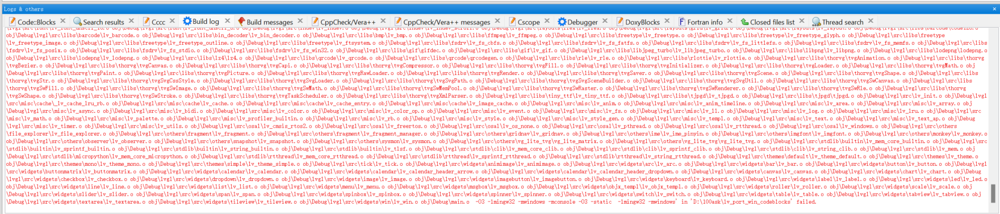
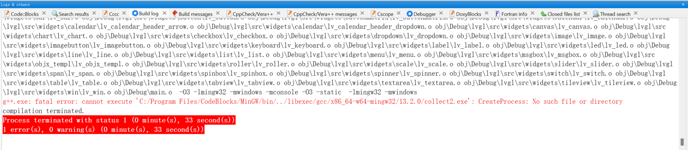
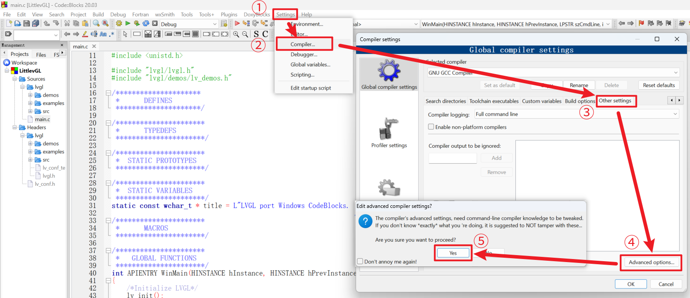
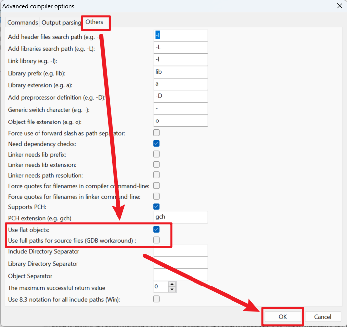

#  Introduction

The document here is to address the issue of. o file information being too long due to too many files in CodeBlocks, which leads to failure during gcc linking.

The error is as follows:

Or:

# Setting steps

Go "Settings->Compiler...->"Other settings" tab -> click "Advanced options". 

In the dialog that pops up, go to the "Others" tab and look near the bottom:

- Use flat objects
- Use full paths for source files (GDB workaround)

