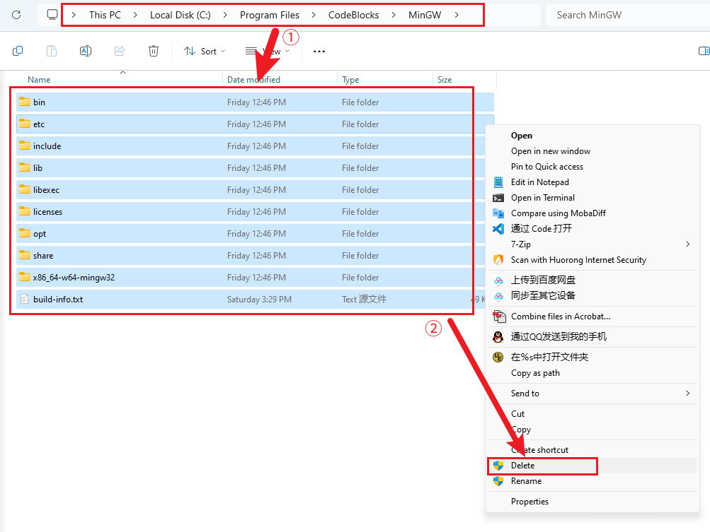
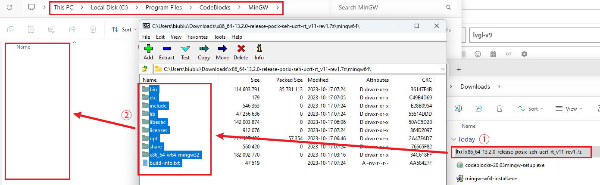
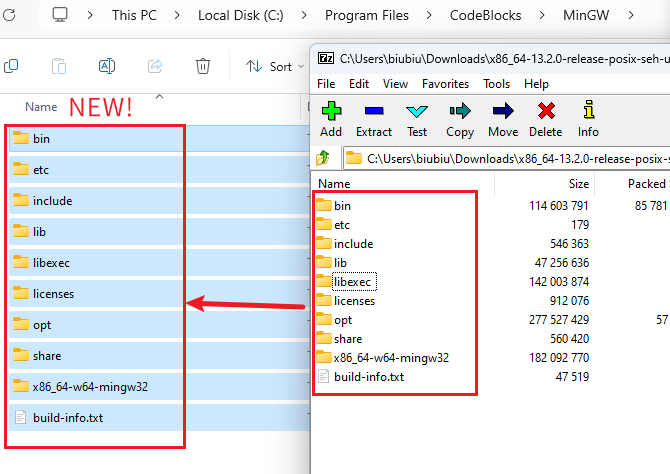
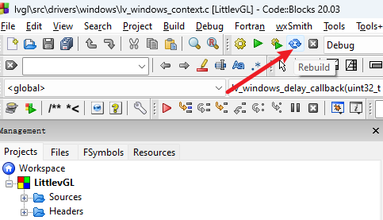

#  Introduction

The LVGL V9 version has updated many new features, and the Windows platform has also been optimized. If you are using [Code::blocks to experience LVGL](https://github.com/lvgl/lv_port_win_codeblocks), it will not pass during compilation; Because if you are using Code::blocks 20.03 and using the built-in MinGW, you will encounter the following problems due to the low version of MinGW:

```shells
D:\lv_port_win_codeblocks\lvgl\src\drivers\windows\lv_windows_context.c|141|error: 'CREATE_WAITABLE_TIMER_MANUAL_RESET' undeclared (first use in this function)|
```

# Upgrade steps

1. Get the updated version of MinGW (recommended version 13.2.0, it has been tested):
[https://github.com/niXman/mingw-builds-binaries/releases](https://github.com/niXman/mingw-builds-binaries/releases/tag/13.2.0-rt_v11-rev1)
2. Open the MinGW directory installed in Code:: blocks 20.03 (default installation directory is `C:\Program Files\CodeBlocks\MinGW`) and delete all contents:

3. Extract the content of the downloaded MinGW compressed file to the `C:\Program Files\CodeBlocks\MinGW` directory:


4. Open [the project](https://github.com/lvgl/lv_port_win_codeblocks) and rebuild it:

